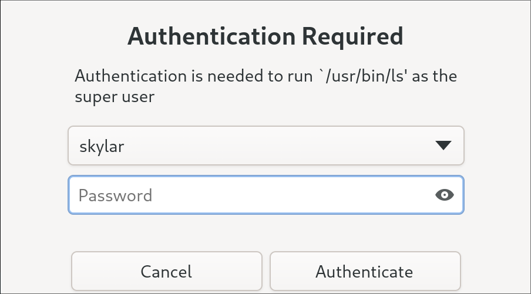

<div align="center">

# Soteria

Soteria is a Polkit authentication agent written in GTK designed to be used with any desktop environment.

</image>
</image>

[Installation](#installation) •
[Why?](#why) •
[Configuration](#configuration) •
[Usage](#usage)

</div>

## Installation
### 1. Arch Linux

Soteria is available on the [AUR](https://aur.archlinux.org/packages/soteria-git) as `soteria-git`
. You can install it using an AUR helper:

```bash
# Using yay
yay -S soteria-git
# or using paru
paru -S soteria-git
```
or manually: 
```bash
git clone https://aur.archlinux.org/soteria-git.git
cd soteria-git
makepkg -si
```
This should place Soteria into `/usr/lib/soteria-polkit/soteria`

### 2. NixOS

Soteria is available as `soteria`. There is a also NixOS module to enable it under ``security.soteria.enable``.
> [!NOTE]
> Some users using non-desktop environments (sway, etc) have reported that ``XDG_SESSION_ID`` is not being properly imported.
> XDG session info is required for the agent to register itself to polkit.
> To fix this, you must import the proper environment variables (assuming systemd is managing the user session):
> ```
> dbus-update-activation-environment --systemd DISPLAY WAYLAND_DISPLAY XDG_CURRENT_DESKTOP
> ```
> For more info, see NixOS/nixpkgs#373290.

### 3. Manual Installation
Soteria requires GTK >= 4.10. Debian based distros will need `libgtk-4-dev`, and Fedora
based distros will need `gtk4-devel`.

Additionally, you will need `polkit` and `libpolkit-agent` installed.
(`libpolkit-agent` should be shipped with `polkit`).

> [!NOTE]
> If the executable `polkit-agent-helper-1`
> is in a non-standard location (i.e. not `/usr/lib/polkit/polkit-agent-helper-1`), then you should also set up a configuration file
> at either ``/usr/local/etc/soteria/config.toml`` or ``/etc/soteria/config.toml`` with
> ```toml
> helper_path = "/path/to/your/helper"
> ```
> as the contents.

Soteria will also need Rust. Currently the only requirement is a compiler that supports the ``edition = 2024``.  (1.85 or newer).

Run the following commmand to build and install Soteria:

```bash
cargo install --locked --git https://github.com/imvaskel/soteria
```

This should place Soteria into ~/.cargo/bin and you can run it from there.


## Usage

Simply have your desktop run the `soteria` binary to have it register as your authentication agent. Once run, anytime an application requests polkit authentication, it should popup and prompt you to authenticate.

For Hyprland, this would look like:

```conf
exec-once = /path/to/soteria
```

You may also like:

```conf
windowrulev2=pin,class:gay.vaskel.soteria
```

This makes sure that Soteria stays pinned to your current workspace.

Other desktop environments should be similiar.

## Why?

When looking for a polkit authentication agent, I noticed that most were either extremely old, using a framework that I didn't like, or completely unstylable.
Additionally, most were hard to edit as they just called out to polkit's `libpolkit-agent` to do all the work. Because of this, I decided to put the work in to figure out how authentication agents worked.

It should be noted that this project does still call out to libpolkit-agent, but only via the polkit agent helper. This is because polkit
uses root sending a dbus response to the polkit daemon to confirm authentication as the identity. I find it non-beneficial to put in
the work to maintain the security implications of a setuid binary.

## Debugging

If you would like to debug why something went wrong, just run `RUST_LOG=debug soteria` and this will start it with debug logging, which should help you identify what's going wrong.
